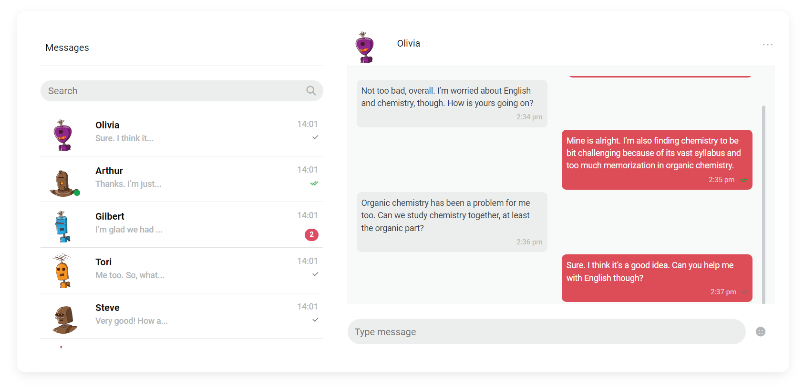

# COMMT: Chat Plugin for ReactJs

<p align="center">

</p>
<br />

Welcome to Commt, a powerful chat plugin designed to seamlessly integrate secure and customizable chat functionalities into your React applications. Offering AES encryption as the default and end-to-end (E2E) support, Commt ensures a secure and reliable real-time communication experience for your users.

## Features

- Written in **TypeScript**
- Fully customizable pre-build components
- Multiple projects support with only one client configuration
- AES encryption as default and end-to-end (E2E) support
- Webhooks usage flexibility
- Customizable and easy to manage system messages
- `Typing`, `user online` and `message read` indicators
- Emoji keyboard and all emoji types support
- Hooks usage flexibility

## Installation

- NPM: `npm i -S @commt/react-sdk`
- Yarn: `yarn add @commt/react-sdk`

## Usage

Get started with Commt in just a few steps:

- Initialize Commt: Import the Provider module and set up the chat plugin in your application by wrap your app with it.
- Implement Secure Chat: Utilize the secure and encrypted chat functionalities.

Check out our [documentation](https://commt.co/doc/reactjs#introduction) for comprehensive usage examples and API reference.

## Example

You can get client configs info from [Commt Dashboard](https://dashboard.commt.co)

**App.tsx**

```
import CommtProvider from "@commt/react-sdk";
import { useInitiate } from "@commt/react-sdk/hooks";

const ClientConfig = {
  apiKey: "123456789?",
  projectId: "0987654321?",
  secret: "123456789018A_7JzPo?23F+4y#erPL" // Must to be 16, 24 or 32 bytes
};

const App = CommtProvider(() => {
  useInitiate(ClientConfig); // Initiate a client

  return (
    {/* All your route configurations etc. */}
  );
});
```

**Home.tsx**

```
import { useSetMessages, useSetRooms, useSetUsers } from "@commt/react-sdk/hooks";

const Home = () => {
  // ...

  const setUsers = useSetUsers();
  const setRooms = useSetRooms();
  const setMessages = useSetMessages();

  useEffect(async () => {
    await setUsers(usersArray); // Set users for commt
    await setRooms(roomsArray); // Set rooms for commt
    setMessages(messagesArray); // Set messages for commt
  }, [usersArray, roomsArray, messagesArray]);

  // ...

  return (
    <div>
      <MDBBtn
            className="m-2 w-100"
            onClick={() => navigate("/chats")}
          >
            Go to Chat
          </MDBBtn>
    </div>
  );
};
```

**Chat.tsx**

```
//...
import {
  MessagesHeader,
  SearchInput,
  MessageList,
  ChatHeader,
  MessageInput,
  Chat,
} from "@commt/react-sdk/components";

import { useGetActiveRoom } from "@commt/react-sdk/hooks";

const Chat = () => {
  // ...
  const { roomId, participants } = useGetActiveRoom();

  return (
    // You can use with fluid for full screen
    <MDBContainer className="py-5">
      <MDBRow>
        <MDBCol md="12">
          <MDBCard id="chat3" style={{ borderRadius: "15px" }}>
            <MDBCardBody>
              <MDBRow>
                <MDBCol
                  md={roomId || participants ? "6" : "12"}
                  lg={roomId || participants ? "5" : "12"}
                  className="mb-4 mb-md-0"
                >
                  <div className="p-3">
                    <MessagesHeader />
                    <SearchInput />
                    <MessageList />
                  </div>
                </MDBCol>
                {(roomId || participants) && (
                  <MDBCol md="6" lg="7">
                    <ChatHeader />
                    <Chat loadMoreMessages={loadMoreMessages} />
                    <MessageInput />
                  </MDBCol>
                )}
              </MDBRow>
            </MDBCardBody>
          </MDBCard>
        </MDBCol>
      </MDBRow>
    </MDBContainer>
  );
};
```

<p align="center">

</p>

## Compatibility

Commt is compatible with:

- [React Native](https://commt.co/doc/react-native)
- [ReactJS](https://commt.co/doc/reactjs)
- [NodeJS](https://commt.co/doc/nodejs)

## Support and Feedback

For any questions, feedback or issues, feel free to reach out to us via <contact@commt.co>.

## License

[MIT](https://github.com/commt/commt-reactjs/blob/master/LICENSE)

## Contributors

- Mesut KILINCASLAN [mkilincaslan](https://github.com/mkilincaslan)
- Sedanur Akçil [sedanurakcil](https://github.com/sedanurakcil)
